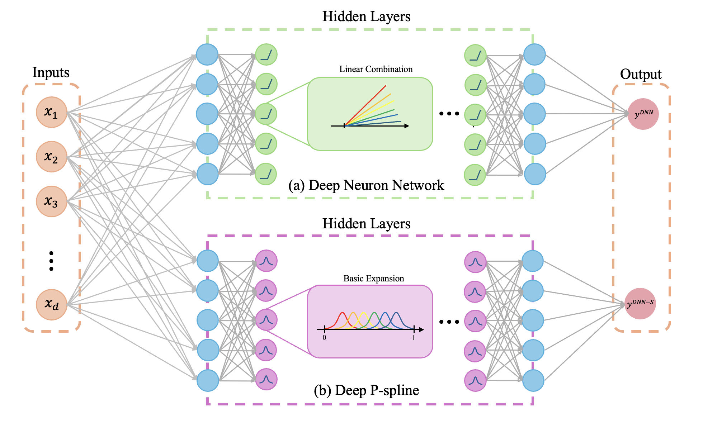
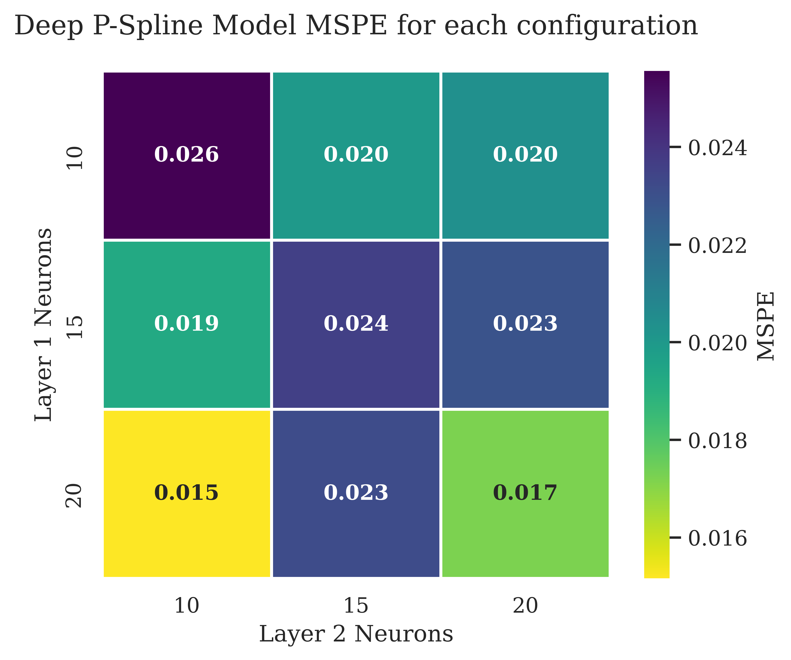
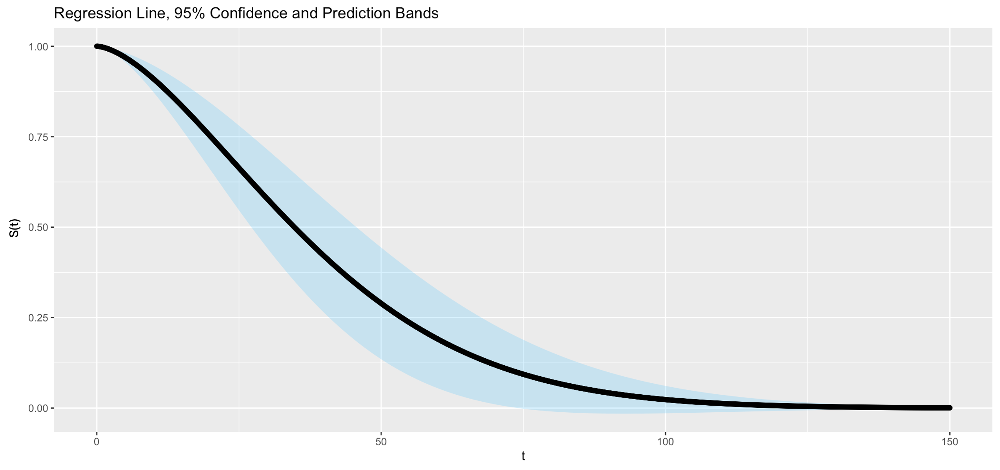

# DPS - Pytorch Implementation 
This is a PyTorch implementation of ["Deep P-Spline: Fast tuning and Theory"](https://arxiv.org/abs/2501.01376) , where we propose the novel structure as follow compared to traditional Deep Neuron Networks (DNNs).


# Quick Start
## Dependency
You can install the Python dependencies with
```
pip3 install -r requirements.txt
```

# Simulation
## 100 individual trials for Example 1
The true function for example 1 is formulated as below:
```math
    y = \exp\{2\sin(0.5\pi x_1) + 0.5\cos(2.5\pi x_2)\}
```
We add noise $\epsilon$ to the true function as:
```math
    \tilde{y}= y+\epsilon,\ \epsilon\sim\mathcal{N}(0, \sigma^2)
```
where $\sigma^2 = 0.05$ Var $(y)$.

The user can customize the specific size for training and testing. For instance, we assume the training size = 800 and the testing size = 200.

<!--
For 1 Layer DPS:
```
python3 DPS_simulation.py --data A --trainsize 800 --testsize 200 --Fin 2 --Fout 1 --nk 15 --nm 50 --rep 100
```

For 2 Layer DPS:
```
python3 2DPS_simulation.py --data A --trainsize 800 --testsize 200 --Fin 2 --Fout 1 --nk 15 --nm 50 --rep 100
```
-->

*(Update) For more flexible setting, we can assign specific configuration of DPS by executing following code:*
```
python3 main.py --data A --nk 15 --hc 50 50 --rep 2 --trainsize 200 --testsize 1000 
```

Afterwards, we will calculate the MSPE and its standard deviation over 100 trials with respect to different training size, and the result is summarized below.

Trainsize\ Method | DS | DPS | 2DS | 2DPS | 
:---: | --- | --- | --- |--- 
200 | 0.086 (0.147) | **0.048 (0.024)** | 0.088 (0.081) | 0.051 (0.031) |
400 | 0.061 (0.116) | 0.031 (0.013) | 0.078 (0.217) | **0.028 (0.008)** |
800 | 0.074 (0.141) | 0.034 (0.017) | 0.044 (0.076) | **0.024 (0.008)** | 

Note: DS(DPS) and 2DS(2DPS) represent one and two layer P-Spline without (with) penalty term respectively.

## 10 individual trials for Table 5
As for Table 4, we consider following equation:
```math
g^*_1({x})= \left[\prod^p_{i=1}\frac{|4x_i-2|+a_i}{1+a_i}\right],\text{ where }a_i=i/2,i=1,\cdots,p
```

In this example, we use the single layer DPS but considering different input dimension from $p=2,6$ and 10. For instance, if we want to run the repeated 10 individual trials when trainsize = 1600, testsize = 1000, $p=2$, knot number = 15, with configuration [50, 50], we need to implement following code:

```
python3 main.py --data B --Fin 2 --nk 15 --hc 50 50 --rep 10 --trainsize 1600 --testsize 1000
```

The above code will return the average MSPE over 10 trials and its standard deviation with $n$ training size. The result is displayed in below table.

| Dim  | Model | n = 200  | n = 400 | n = 800  | n = 1500 |
| :-----:| :------: |:-----:| :-----:| :-----:| :-----:|
| d=2  | DS | 0.0056 (0.0012) | 0.0042 (0.0007) | 0.0026 (0.0005) | 0.0027 (0.0009) |
| d=2  | DPS   | **0.0041** (0.0017) | **0.0018** (0.0004) | **0.0015** (0.0003) | **0.0011** (0.0004) |

## 5 Individual Trials for Sparse Dataset
In the simulation corresponding to Table 5, we evaluate the performance of the proposed DPS method on sparse datasets with input dimensions set to 10, 30, and 50. Even without enforcing sparsity within the DPS model, it consistently outperforms standard DNNs under comparable architectures. Notably, the GCV criterion effectively guides the selection of the optimal architecture among the candidate models. Each experiment is conducted with a training size of 1600 and a testing size of 200, where the input dimension is denoted by $p$, the number of knots by $k$, the number of neurons by $m$, and the number of layers by $l$.

```
python3 main.py --data B --nk 15 --hc 50 50 --rep 2 --trainsize 1600 --testsize 200 --lr 1e-1 --fine_tune_nepochs 1000
```

## (Updated Simulation)

### Large Dataset
In the folder `./src/experiments`, we add the script file to implement the DPS on several large dataset.

✅ For California Housing, BikeShare, and Churn, we can refer to .sh file in `./src/scripts`.
```

module purge
module load python
module load pytorch


PARAM_LIST=(
  "--hc 256 128 64 --nk 15 --fine_tune_lr 1e-5 --dropout 0.2 --case ca"
  "--hc 128 64 32 --nk 15 --fine_tune_lr 1e-6  --dropout 0.2 --case bike"
  "--hc 128 64 32 --nk 10 --fine_tune_lr 1e-5 --dropout 0.2 --case churn"
)


PARAMS="${PARAM_LIST[$SLURM_ARRAY_TASK_ID]}"
python3 run_large_exp.py $PARAMS
```

✅ YearPredictionMSD: 
> The dataset for YearPredictionMSD is too big so I did not upload to Github. The original code can be downloaded from https://archive.ics.uci.edu/dataset/203/yearpredictionmsd and just move the .txt file to fold `./src/Real_data`, then the code will automatically read the file while running the simulation.
```
cd ./src/experiments
python3 run_year.py --hc 128 64 32 --nk 10 --lr 5e-3 --fine_tune_lr 1e-5 --dropout 0.2"
```

where the optimal configuration for each case is stored in `./src/experiments/best_model`

> The benchmark (XGB, DNN, Random Forest) for the large dataset can be found in `Real-Data-Analysis.ipynb` where the (P-Spline, MARS) can be found in `benchmark_Real_Data.R`.

### Model Selection
We implement how GCV assists on model selection. The example is demonstrated on example 4.1 in the paper where training size $n=200$. We first fixed the configuration as $\{15,15\}$ where for each layer the neuron number candidate $\in\{10, 15, 20\}$ with $3^2$ combinations. In the following figure, we compute the corresponding MSPE. The figure support the statement that the score surface is smooth around the selected fixed $\{W,L\}$-network.

The notebook `./src/experiments/Simulation-AppendixH.ipynb` demonstrates the generating process of the following figure.


In the paper, we simulation 100 times and compute the mean and standard deviation to support the smoothness of the model performance. To replicate the experiment,
```
cd ./src/experiments
python3 run_ms.py
```
The output file recording the MSPE for the simulation will be stored in `./logs/MSPE_compared.npy`. 

## Simulation
The simulation for *Table 6 and 7*, *brain tumor image classification*, and *chip data* will be demonstrated in jupyter notebook.

✅ Brain Tumor MRI Image classification: `./demo_simulation/Sim_Braintumor.ipynb`

✅ MNIST Image classification: `./demo_simulation/Sim_MNIST.ipynb`

✅ Table 3 demo: `./demo_simulation/Sim_ModelSelection.ipynb`

✅ Double descent: `./demo_simulation/Sim_DoubleDescent.ipynb`

✅ Surrogate model for Chip data: `./demo_simulation/Sim_Chip.ipynb`

*(Update) In Appendix G-4 and Appendix H, we add the additional experiment for larger dataset such as California Housing, Bikeshares, and YearPredictionMSD and how GCV provides the insight of model selection.*

✅ Brain Tumor MRI Image classification: `./src/experiments/Real-Data-Analysis.ipynb`
✅ Brain Tumor MRI Image classification: `./src/experiments/Simulation-AppendixH.ipynb`

### Chip Data
For building the surrogate model for chip data, we utilize python and R for convenience. Following the steps below, you can replicate the experiment in Section 6.2 for building the survival function $S(t)$ for chip data.

- Use the `./demo_simulation/MaxPro_Sampling.R` to generate Candidate Design Points Randomly for Various Types of Factors related to chip data.
- By the sampling matrix from `Maxpro`, we can run DPS on `./demo_simulation/Sim_Chip.ipynb` for prediction.
- Besides the prediction from DPS, we extract the value of last hidden layer in DPS and feed it to Gaussian process in `MaxPro_Sampling.R`.
- According to the property of Gaussian process, we can construct the survival function and its confidence interval over its lifespan.


