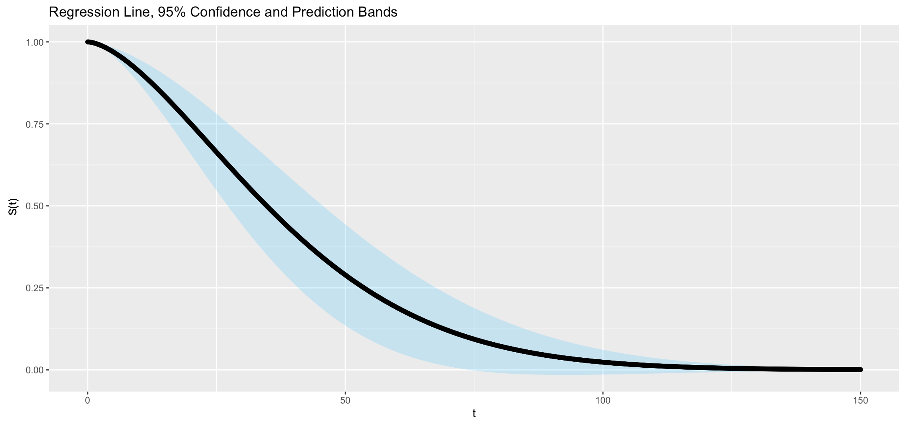

# DPS - Pytorch Implementation 
This is a PyTorch implementation of ["Deep P-Spline: Fast tuning and Theory"](https://arxiv.org/abs/2501.01376) , where we propose the novel structure as follow compared to traditional Deep Neuron Networks (DNNs).


# Quick Start
## Dependency
You can install the Python dependencies with
```
pip3 install -r requirements.txt
```

# Simulation
## 100 individual trials for Example 1
The true function for example 1 is formulated as below:
```math
    y = \exp\{2\sin(0.5\pi x_1) + 0.5\cos(2.5\pi x_2)\}
```
We add noise $\epsilon$ to the true function as:
```math
    \tilde{y}= y+\epsilon,\ \epsilon\sim\mathcal{N}(0, \sigma^2)
```
where $\sigma^2 = 0.05$ Var $(y)$.

The user can customize the specific size for training and testing. For instance, we assume the training size = 800 and the testing size = 200.

For 1 Layer DPS:
```
python3 DPS_simulation.py --data A --trainsize 800 --testsize 200 --Fin 2 --Fout 1 --nk 15 --nm 50 --rep 100
```

For 2 Layer DPS:
```
python3 2DPS_simulation.py --data A --trainsize 800 --testsize 200 --Fin 2 --Fout 1 --nk 15 --nm 50 --rep 100
```

Afterwards, we will calculate the MSPE and its standard deviation over 100 trials with respect to different training size, and the result is summarized below.

Trainsize\ Method | DNN-S | DPS | 2DNN-S | 2DPS | 
:---: | --- | --- | --- |--- 
200 | 0.086 (0.147) | **0.048 (0.024)** | 0.088 (0.081) | 0.051 (0.031) |
400 | 0.061 (0.116) | 0.031 (0.013) | 0.078 (0.217) | **0.028 (0.008)** |
800 | 0.074 (0.141) | 0.034 (0.017) | 0.044 (0.076) | **0.024 (0.008)** | 


## 10 individual trials for Table 5
As for Table 5, we consider following equation:
```math
g^*_1({x})= \left[\prod^p_{i=1}\frac{|4x_i-2|+a_i}{1+a_i}\right],\text{ where }a_i=i/2,i=1,\cdots,p
```

In this example, we use the single layer DPS but considering different input dimension from $p=2,6$ and 10. For instance, if we want to run the repeated 10 individual trials when trainsize = 1600, testsize = 200, $p=2$, knot number = 15, neuron number = 50,

```
python3 DPS_simulation.py --data B --trainsize 1600 --testsize 200 --Fin 2 --Fout 1 --nk 15 --nm 50 --rep 100
```

The above code will return the average MSPE over 10 trials and its standard deviation with $n$ training size. The result is displayed in below table.

| Dim  | Model | n = 200  | n = 400 | n = 800  | n = 1500 |
| :-----:| :------: |:-----:| :-----:| :-----:| :-----:|
| d=2  | DNN-S | 0.0056 (0.0012) | 0.0042 (0.0007) | 0.0026 (0.0005) | 0.0027 (0.0009) |
| d=2  | DPS   | **0.0041** (0.0017) | **0.0018** (0.0004) | **0.0015** (0.0003) | **0.0011** (0.0004) |

## Simulation
The simulation for *Table 4*, *brain tumor image classification*, and *chip data* will be demonstrated in jupyter notebook.

✅ Brain Tumor MRI Image classification: `./demo_simulation/Sim_Braintumor.ipynb`

✅ Table 4 demo: `./demo_simulation/Sim_ModelSelection.ipynb`

✅ Double descent: `./demo_simulation/Sim_DoubleDescent.ipynb`

✅ Surrogate model for Chip data: `./demo_simulation/Sim_Chip.ipynb`

### Chip Data
For building the surrogate model for chip data, we utilize python and R for convenience. Following the steps below, you can replicate the experiment in Section 6.2 for building the survival function $S(t)$ for chip data.

- Use the `./demo_simulation/MaxPro_Sampling.R` to generate Candidate Design Points Randomly for Various Types of Factors related to chip data.
- By the sampling matrix from `Maxpro`, we can run DPS on `./demo_simulation/Sim_Chip.ipynb` for prediction.
- Besides the prediction from DPS, we extract the value of last hidden layer in DPS and feed it to Gaussian process in `MaxPro_Sampling.R`.
- According to the property of Gaussian process, we can construct the survival function and its confidence interval over its lifespan.



